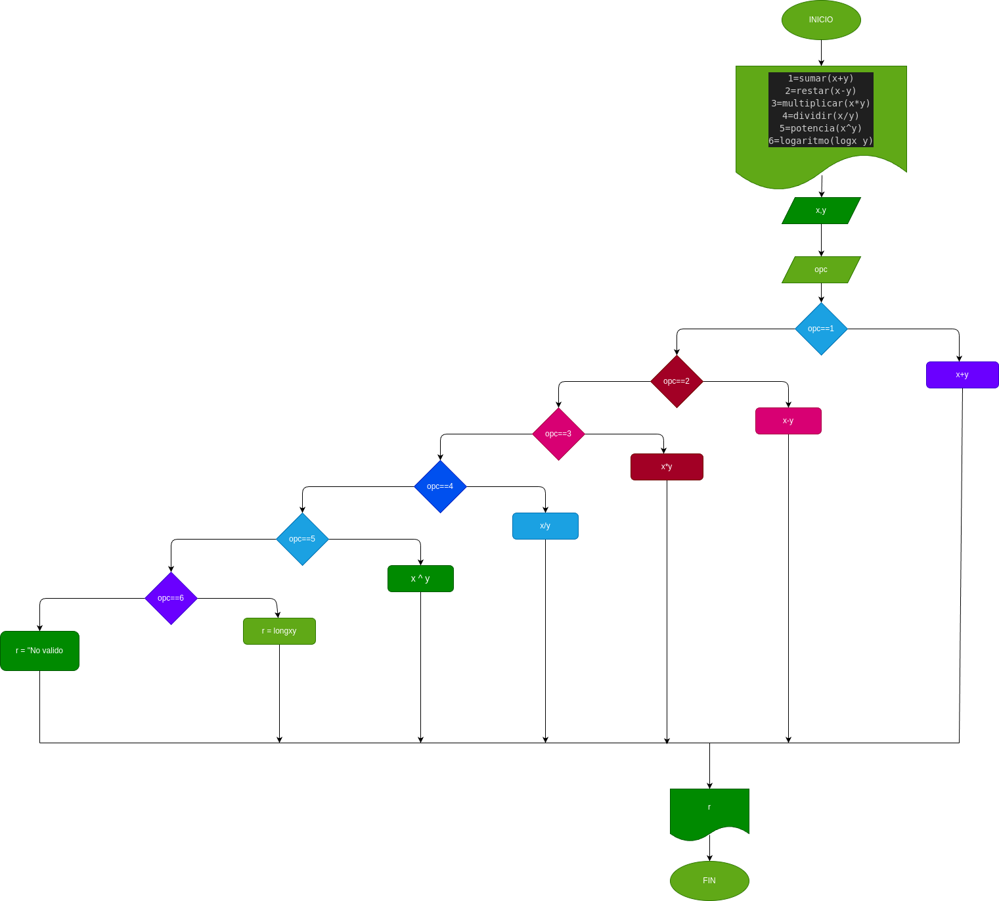

# Mini_calculadora
programa para calcurar operaciones 
# analisis
## input 
### variables de entrada 

1=sumar(x+y)

2=restar(x-y)

3=multiplicar(x*y)

4=dividir(x/y)

5=potencia(x^y)

6=logaritmo(logx y)

## proseso 
resultado de la opcion elejida 
## Diseño

